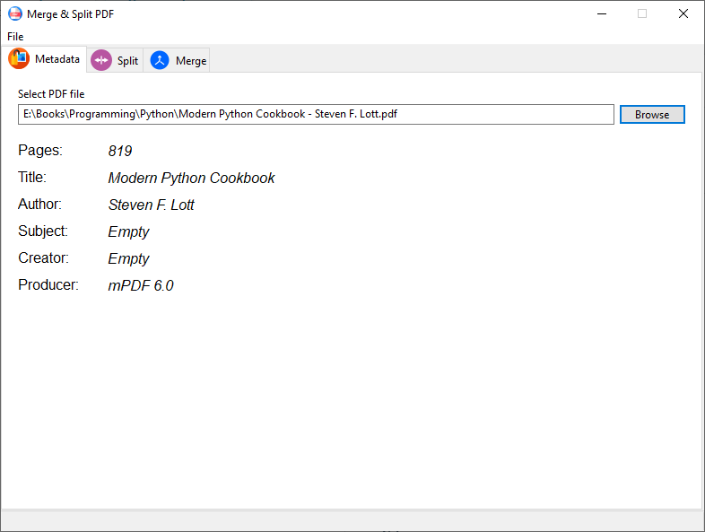
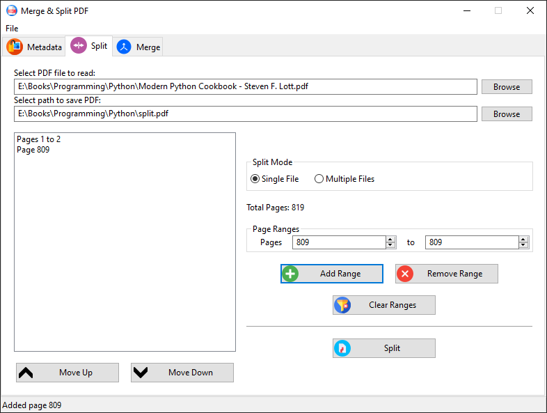
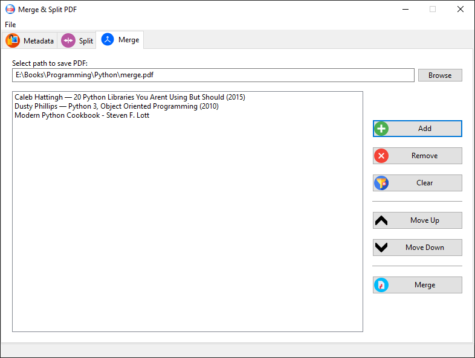

# MSCPDF
Program for working with PDF files based on wxPython and PyPDF libraries

## Features

- Metadata extraction
- Page extraction
- File merge

## Screenshots

## Tools

- Python ver. 3.11.4
- wxPython ver. 4.2.1
- pypdf ver. 4.2.0